# Trabajo_Jenkins

# 1.  Crear volumen de jenkis 
--------------------------------
1. Verificar Docker
- Version que manejo 28.4

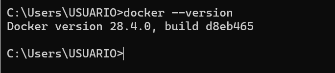
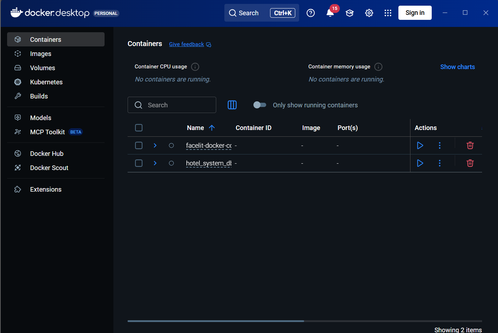
-----------------------------------

2.  Crear volumen persistente
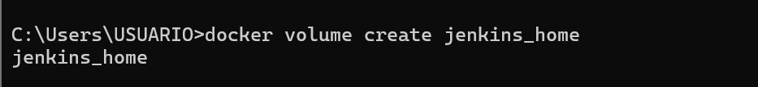

-------------------------------

3. Ejecutar Jenkins en Docker
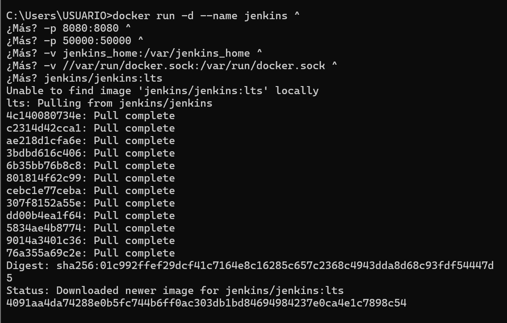

------------------------------------

4. Verificar que Jenkins está corriendo
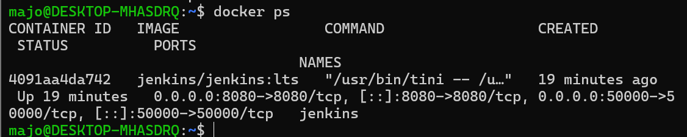

-------------------------------------

5. Entrar a Jenkins
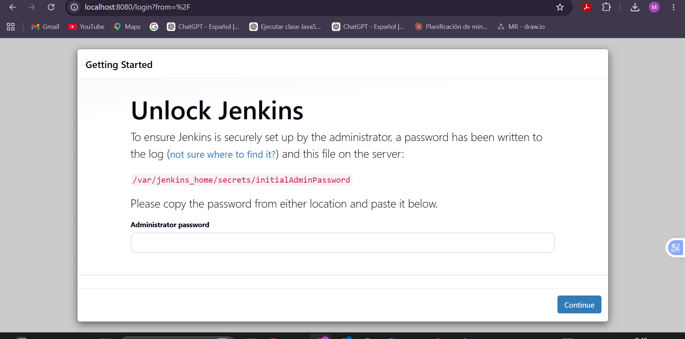

--------------------------------
6.  Obtener contraseña inicial

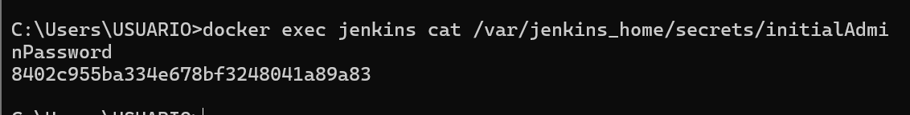
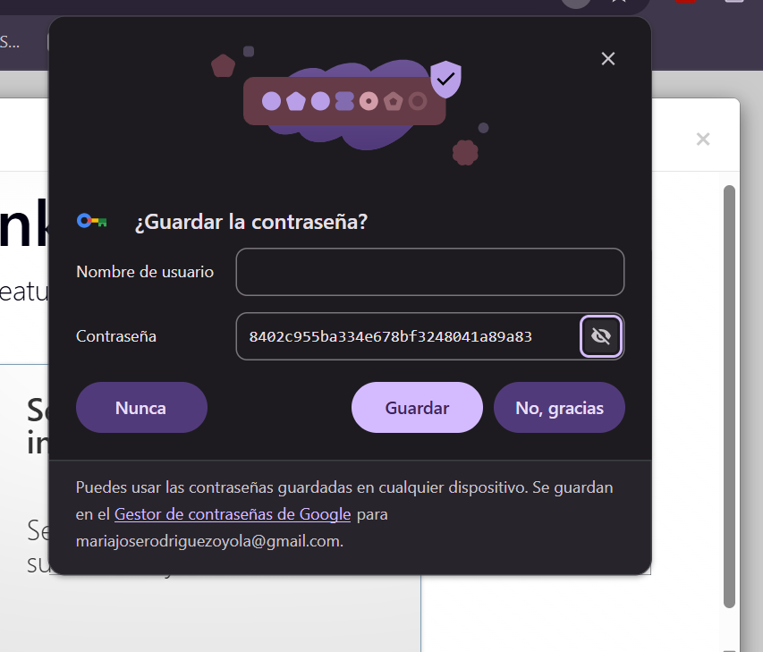

-------------------------
7. Crear usuario
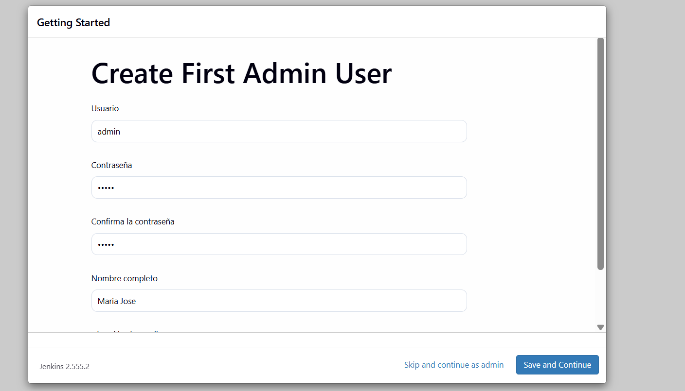
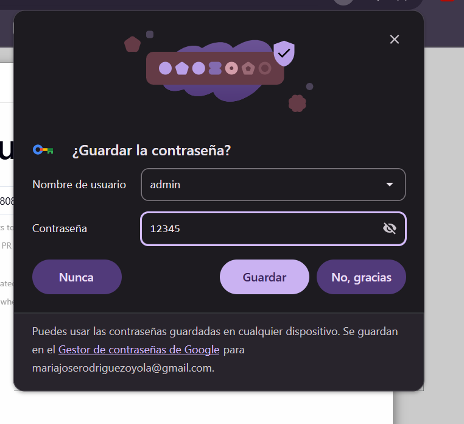

Contraseña : 12345
----------------------
8. URL 

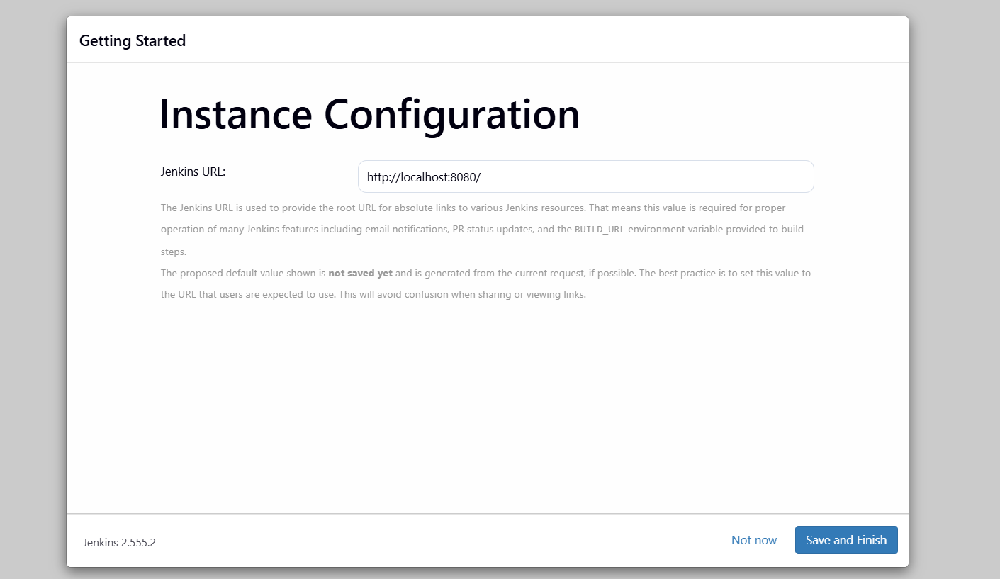
------------------------
9. Programas intalados correctamente 

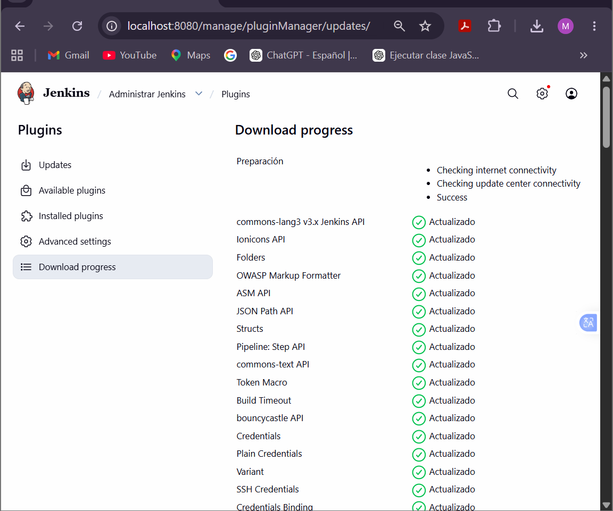

----------------------------------
---------------------------------
# 2. instalar Maven dentro del contenedor Docker.

  1. Entrar al contenedor como root y Actualizar paquetes
  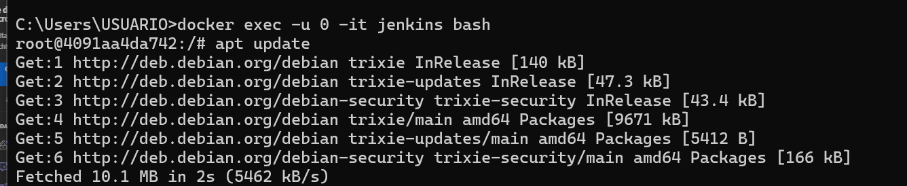

  2. Instalar Maven
  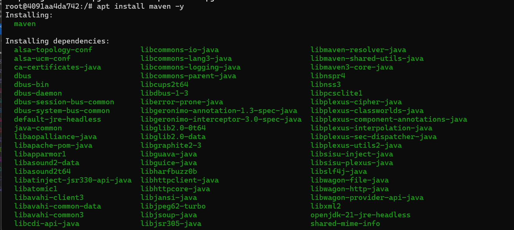

  3. Verificar Maven
  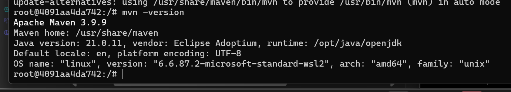

  4. Configurar Maven en Jenkins
  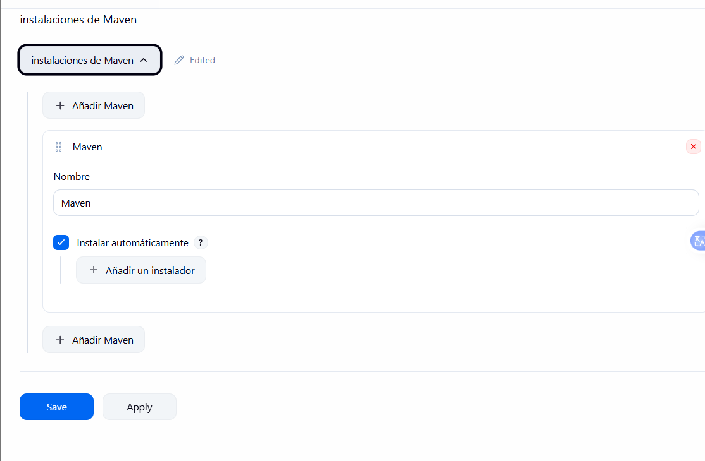

  5. Verificar Maven dentro del contenedor
  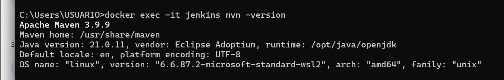

  6. Crear el Job
  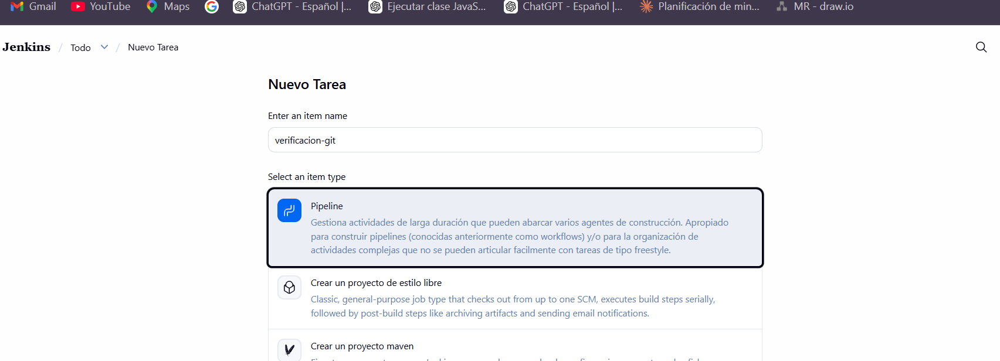

7. Pegar el código
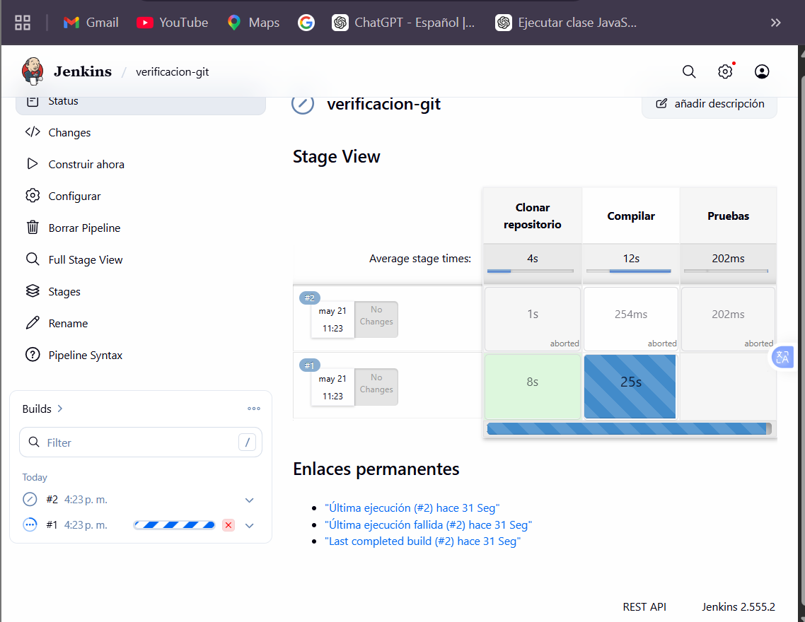
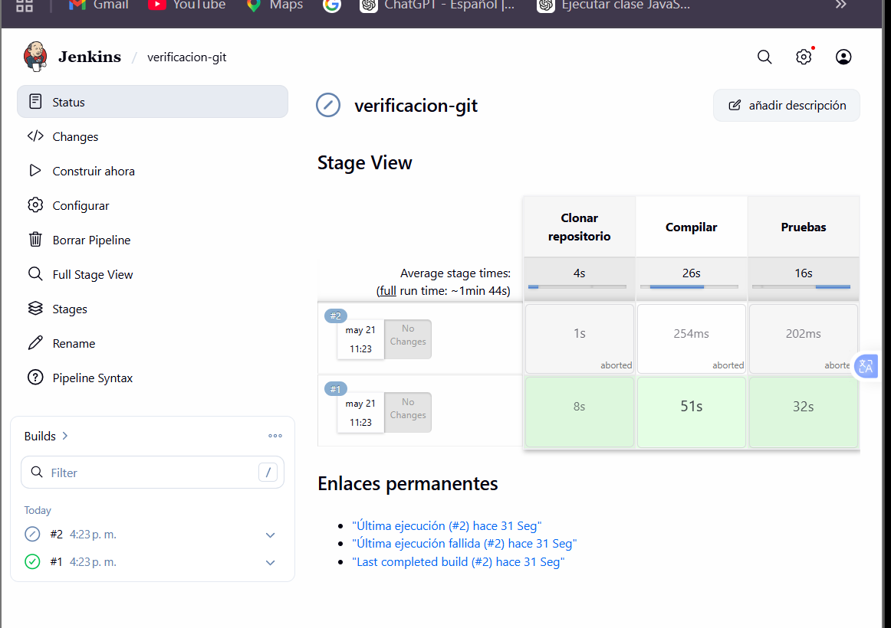

---------------------------------

